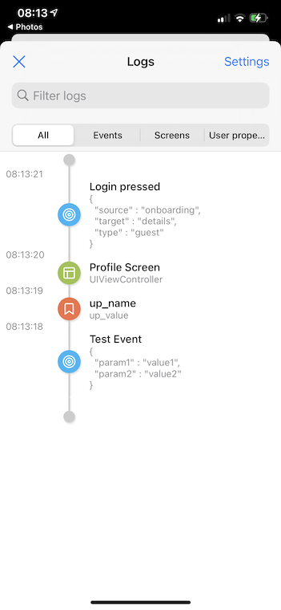
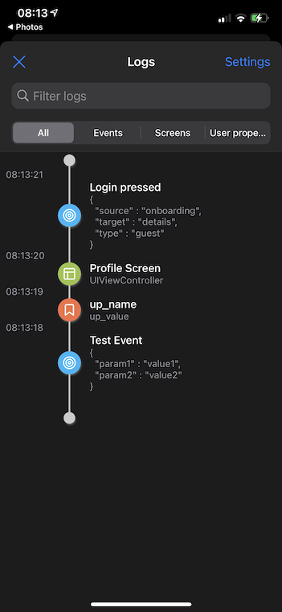
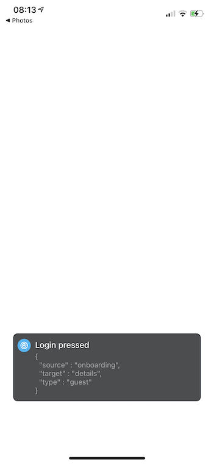

# Collar

[](https://cocoapods.org/pods/Collar)
[](https://cocoapods.org/pods/Collar)
[](https://cocoapods.org/pods/Collar)

Collar is a library which simplifies analytics debugging by showing events, screen views and user properties of your app as they happen.

## Requirements

* Swift 5.1
* Xcode 11.0
* iOS 11.0

## Installation

Collar is available through [CocoaPods](https://cocoapods.org). To install it, simply add the following line to your Podfile:

```ruby
pod 'Collar'
```



## Usage

##### 1. In your analytics manager add support for analytics collecting via Collar:

```swift
import Collar

// Events
AnalyticsCollectionManager.shared.log(event: "some_event", parameters: [
    "param1": "value1",
    "param2": "value2"
])

// User properties
AnalyticsCollectionManager.shared.setUserProperty("some_value", forName: "user_property_key")

// Screen views
AnalyticsCollectionManager.shared.track(screenName: "Home", screenClass: "HomeViewController")
```

**IMPORTANT:** Collar does **NOT** send out analytics data to remote services. This is left for the developer to solve in their own codebase, with Collar being simply a reflection of the current state of analytics data.

##### 2. At the point where you want to display collected logs, you can just put the following line:

```swift
AnalyticsCollectionManager.shared.showLogs(from: viewController)
```

##### 3. If you want to display popup every time event/user property/screen view is tracked, you can just use the following snippet:

```swift
// Also controllable from settings screen inside logs view
LogItemPopupQueue.shared.enabled = true
// Popup dismisses on tap or after defined number of seconds
LogItemPopupQueue.shared.showOnView = { UIApplication.shared.keyWindow }
```

If you would like to receive notifications when new logs are added to the list, your app can observe `AnalyticsCollectionManager.Notification.didUpdateLogs` notification.

## Important

Please make sure that `AnalyticsCollectionManager` and `LogItemPopupQueue` are not used in production builds. Best option would be not to include Collar in you production targets/configurations at all, for example:

```ruby
pod 'Collar', :configurations => ['Development-release', 'Development-debug']
```

## Example

To run the example project, clone the repo, and run `pod install` from the Example directory first.

## Author

Filip Gulan, filip.gulan@infinum.com

## Credits

Maintained and sponsored by [Infinum](http://www.infinum.com).


## License

Collar is available under the MIT license. See the LICENSE file for more info.
