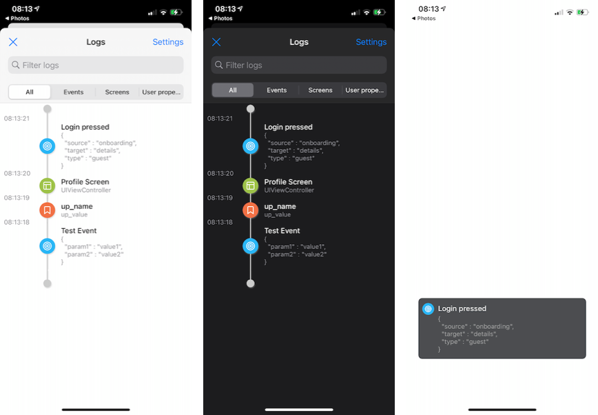

# Collar

[](https://cocoapods.org/pods/Collar)
[](https://cocoapods.org/pods/Collar)
[](https://cocoapods.org/pods/Collar)

Collar is a library which simplifies analytics debugging by showing events, screen views and user properties of your app as they happen.

## Requirements

* Swift 6.0
* Xcode 16.0
* iOS 15.0

## Installation

## CocoaPods

Collar is available through [CocoaPods](https://cocoapods.org). To install it, simply add the following line to your `Podfile`:

```ruby
pod 'Collar'
```

## SwiftPM

If you are using the [SwiftPM](https://www.swift.org/package-manager/) as your dependencies manager, add this to the dependencies in your `Package.swift` file:

```swift
dependencies: [
    .package(url: "https://github.com/infinum/ios-collar.git")
]
```



## Usage

### ⚠️ Breaking Changes in v2.0.0

Collar v2.0.0 introduces Swift 6 concurrency support with **breaking changes**:

- The `logs` read property is now `async` and must be `await`ed
- Notifications are posted on an internal serial `DispatchQueue` (not the main queue) - observers must handle their own threading

See the [Migration Guide](#migration-from-v1x-to-v20) below for detailed upgrade instructions.

---

##### 1. In your analytics manager add support for analytics collecting via Collar:

```swift
import Collar

// Events
AnalyticsCollectionManager.shared.log(event: "some_event", parameters: [
    "param1": "value1",
    "param2": "value2"
])

// User properties
AnalyticsCollectionManager.shared.setUserProperty("some_value", forName: "user_property_key")

// Screen views
AnalyticsCollectionManager.shared.track(screenName: "Home", screenClass: "HomeViewController")
```

**These calls dispatch fire-and-forget onto an internal queue and return immediately — no `await` needed.**

**IMPORTANT:** Collar does **NOT** send out analytics data to remote services. This is left for the developer to solve in their own codebase, with Collar being simply a reflection of the current state of analytics data.

##### 2. At the point where you want to display collected logs:

```swift
/// UIKit
Task {
    await AnalyticsCollectionManager.shared.showLogs(from: viewController)
}

/// SwiftUI
Button(action: { isPresented = true }) { ... }
    .collarLogSheet(isPresented: $isPresented)
```

##### 3. Reading logs asynchronously:

```swift
// Get all logs (async)
let logs = await AnalyticsCollectionManager.shared.logs

// Clear all logs
AnalyticsCollectionManager.shared.clearLogs()

// Clear specific log
AnalyticsCollectionManager.shared.clearLog(logItem)
```

##### 4. Observing log updates (notification threading):

```swift
NotificationCenter.default.addObserver(
    forName: NSNotification.Name("AnalyticsCollectionManager.didUpdateLogs"),
    object: nil,
    queue: nil
) { _ in
    // ⚠️ v2.0: Notification is posted on an internal serial DispatchQueue (NOT main queue)
    // For UI updates, dispatch to main queue:
    Task { @MainActor in
        self.updateUI()
    }
}
```

## Migration from v1.x to v2.0

### Step 1: Update dependency version

Update your `Podfile` or `Package.swift` to v2.0.0:

```ruby
pod 'Collar', '~> 2.0'
```

### Step 2: Update log reads to `await`

Write methods (`log`, `setUserProperty`, `track`, `clearLogs`, `clearLog`) are unchanged — no `await` needed.

Only the `logs` read property is now `async`:

**Before (v1.x):**
```swift
let logs = AnalyticsCollectionManager.shared.logs // Blocking sync call
```

**After (v2.0):**
```swift
let logs = await AnalyticsCollectionManager.shared.logs // Non-blocking async
```

### Step 3: Update notification observers

**Before (v1.x):**
```swift
NotificationCenter.default.addObserver(...) { _ in
    self.updateUI() // Already on main queue
}
```

**After (v2.0):**
```swift
NotificationCenter.default.addObserver(...) { _ in
    Task { @MainActor in
        self.updateUI() // Explicit main queue dispatch
    }
}
```

## Important

Please make sure that `AnalyticsCollectionManager` is not used in production builds. Best option would be not to include Collar in you production targets/configurations at all, for example:

```ruby
pod 'Collar', :configurations => ['Development-release', 'Development-debug']
```

## Example

To run the example project, clone the repo, and run `pod install` from the Example directory first.

## Author

Filip Gulan, filip.gulan@infinum.com

## Credits

Maintained and sponsored by [Infinum](http://www.infinum.com).


## License

Collar is available under the MIT license. See the LICENSE file for more info.
